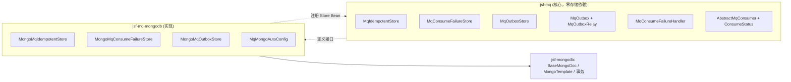
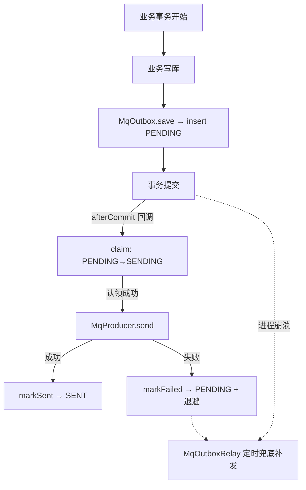

# jsf-mq 消息可靠性设计

> 归档时间：2026-07-29
> 涉及模块：`jsf-mq`（核心）、`jsf-mq-mongodb`（MongoDB 落库实现）

## 1. 背景与目标

RocketMQ 为 **at-least-once** 语义：消息可能重复投递、发送与业务写库之间存在原子性缺口。本设计解决三类可靠性问题：

1. **发送可靠**：业务写库与消息发送的原子性（Outbox 模式 + relay 兜底）；
2. **消费幂等**：重复投递去重（幂等助手）；
3. **消费失败兜底**：失败分类处理（重试 / 丢弃落库 / 重放补偿）。

## 2. 架构：依赖倒置（DIP）

核心 `jsf-mq` **只定义接口与编排逻辑，零存储依赖**；落库方式作为可插拔实现模块提供。当前提供 MongoDB 实现（`jsf-mq-mongodb`），未来支持其他存储只需新增同类模块实现三个 Store 接口。



装配机制：

- `MqMongoAutoConfig` 标注 `@AutoConfigureBefore(MqAutoConfig.class)`，保证 Store Bean 先注册；
- 核心 `MqAutoConfig` 通过 `@ConditionalOnBean(XxxStore.class)` 条件装配 `MqOutbox` / `MqOutboxRelay` / `MqConsumeFailureHandler`；
- 所有 Bean 均 `@ConditionalOnMissingBean`，业务可自定义实现覆盖。

## 3. 发送可靠：Outbox + 立即投递 + relay 兜底

### 3.1 状态机（枚举 `MqOutboxStatus`）

```
PENDING ──claim──► SENDING ──send成功──► SENT (终态)
   ▲                  │
   └──markFailed──────┘ (未耗尽：PENDING + 退避 nextRetryAt)
                      │
                      └──耗尽──► FAILED (终态，人工介入)
```

### 3.2 时序：立即投递（immediate dispatch）



关键设计点：

| 设计点 | 说明 |
|---|---|
| 发送在事务提交后 | `TransactionSynchronization.afterCommit`，避免"消息发出但事务回滚"的幻影消息；事务内只 insert |
| 立即投递失败不抛异常 | 业务事务已提交，只记 warn，relay 兜底保证最终送达 |
| 认领协议防竞争 | 立即投递与 relay 都先 `claim`（Mongo findAndModify 原子操作），集群单行单实例 |
| insert 缓冲 | `nextRetryAt = now + initialBackoffSeconds`，relay 天然避开立即投递窗口 |
| 僵尸行接管 | `SENDING 且 lockExpireAt < now` 视为认领者崩溃，relay 可重新认领重发 |
| 指数退避 | `initialBackoff * 2^(attempt-1)`，上限 `maxBackoffSeconds` |
| 重试耗尽 | `attempt >= maxAttempts`（默认 16）置 `FAILED` 终态 + error 日志告警 |

### 3.3 业务用法

```java
@Transactional
public void createOrder(OrderCmd cmd) {
    orderRepo.save(order);
    mqOutbox.save("order-topic", "created", new OrderCreatedEvent(order.getId()));
    // 事务提交后自动立即投递；失败由 relay 兜底
}
```

> 事务边界说明：Outbox insert 与业务写库的原子性依赖同一个 Mongo 事务
> （`MongoTransactionManager` + 副本集）。业务库非 Mongo 时降级为 best-effort。

## 4. 消费幂等：MqIdempotentStore

三段式协议，兼顾"真重复跳过"与"失败重试不误判"：

```
tryClaim(key, ttl) ──true──► handleMessage ──成功──► markProcessed (终态)
       │                          │
       └──false──► 跳过(重复)      └──失败──► release (允许 broker 重试再进入)
```

- 声明带 `claimExpireAt`：消费者崩溃未 release 时，声明过期后可被原子接管（findAndModify），避免消息丢失；
- Mongo 实现：`key` 唯一索引保证 insert 原子性；`expireAt` TTL 索引自动清理历史（默认保留 7 天）；
- 消费者启用方式：覆写 `idempotentKey(T message)` 返回非空键即可（需容器存在 `MqIdempotentStore` 实现）。

## 5. 消费失败：ConsumeStatus 三态 + 失败落库 + 重放

### 5.1 三态枚举（替代原 `rethrowOnError()` 布尔开关）

```java
protected abstract ConsumeStatus handleMessage(T message) throws Exception;
```

| 返回值 | 基类行为 | 适用场景 |
|---|---|---|
| `SUCCESS`（或 null） | ack 确认；幂等 markProcessed | 正常 |
| `RETRY_LATER` | 抛 `MqException` 触发 broker 重试（16 次后进 `%DLQ%+group`）；幂等 release | 瞬时故障（下游超时等） |
| `DISCARD` | 不重试；`MqConsumeFailureHandler` 落库；幂等 release（不阻塞重放） | 不可重试失败（格式错误、业务拒绝） |

处理逻辑抛出的异常默认按 `RETRY_LATER` 处理。

### 5.2 失败记录与重放

- 落库内容：topic/tag/consumerGroup/consumerClass/bizKey/payload/errorMsg/stackTrace/failedAt；
- 状态枚举 `MqConsumeFailureStatus`：`PENDING → REPLAYED`；
- 重放入口：`MqConsumeFailureHandler.replay(limit, replayer)`，单条失败保持 PENDING 不影响其余；
- `save` 内部吞掉存储异常（只记 error 日志），失败落库不反噬消费线程。

## 6. 状态字段规约

**所有状态字段一律定义为枚举**（`MqOutboxStatus` / `MqConsumeFailureStatus`），禁止魔法字符串。
Spring Data Mongo 按枚举 `name()` 存为字符串，可直接在库里按 `status: "PENDING"` 查询，无需自定义 Converter。

## 7. 配置项（前缀 `jsf.mq.outbox`）

```yaml
jsf:
  mq:
    outbox:
      immediate-send: true          # 事务提交后立即投递（false 则纯 relay 轮询）
      max-attempts: 16              # 重试耗尽阈值，耗尽置 FAILED
      lock-seconds: 60              # 认领锁时长，SENDING 超时视为僵尸行
      initial-backoff-seconds: 10   # 首次退避，同时是 insert 时的 relay 缓冲
      max-backoff-seconds: 3600     # 退避上限
      relay:
        enabled: true               # relay 兜底开关（需应用 @EnableScheduling）
        interval: 5000              # 扫描间隔（毫秒）
        batch-size: 100             # 单轮批量
```

## 8. MongoDB Collection 设计

| Collection | 关键索引 | 说明 |
|---|---|---|
| `mq_outbox` | `(status, nextRetryAt)` 复合索引 | relay fetchPending 扫描 |
| `mq_idempotent` | `key` 唯一索引；`expireAt` TTL 索引 | tryClaim 原子性；历史自动清理 |
| `mq_consume_failure` | `status` 索引 | 待重放查询 |

> 注：注解式索引需开启 `spring.data.mongodb.auto-index-creation: true`，或按上表手工建索引。

## 9. 明确不做 / 待议

- **信封 `MqMessage<T>`（通用消息体）**：opt-in 方案已讨论未实施，待需要 traceId 透传时再落地；
- **DLQ 消费模板与告警**：进入死信后的消费/告警链路暂未提供，业务可自建 `%DLQ%+group` 消费者；
- **重试 topic 模式**（框架控制退避节奏）：作为可选能力后续评估。

## 10. 分层边界：MqOutbox 依赖 MqProducer（而非相反）

设计上 `MqOutbox` 持有 `MqProducer`（`MqOutbox.java:33-44`），而不是 `MqProducer` 持有 `MqOutbox`。这是明确的上下层关系，依赖只能单向：

| 维度 | `MqProducer` | `MqOutbox` |
|---|---|---|
| 定位 | 传输原语（底层） | 可靠性编排层（高层） |
| 职责 | 封装 `RocketMQTemplate` 的 `send/async/oneway/delay` 四类 API，只负责"把一条消息发给 broker" | 负责"事务内落库 + 提交后投递 + 失败兜底"的业务语义 |
| 事务感知 | 无，不关心是否在事务内 | 有，`save()` 事务内 `insert`、注册 `afterCommit` 才发 |
| 是否可选 | 始终存在 | 按调用点决定是否启用（并非所有发送都需要） |

关键理由：

1. **职责单一 / 编排者组合原语**：`MqProducer`（`MqProducer.java:24-116`）只是发送原语，不知道事务、Outbox 表、relay；`MqOutbox` 在正确时机调用 `producer.send(...)`（`MqOutbox.java:91`）完成编排。
2. **依赖方向单向（DIP）**：`MqOutbox → MqProducer` 是"高层依赖低层"。若反过来，`MqProducer` 被迫认识 `MqOutboxStore`、事务、`relay`，污染发送原语。
3. **Outbox 是按调用点决定的可选模式，不能强加给所有发送**：`sendOneway`（日志/埋点，不保证可靠）、`sendAsync`、直接 `producer.send()`（非本地事务原子场景）都应能轻量直发。若 Producer 内含 Outbox，每次 send 都先写表，丧失直发能力。
4. **事务边界属于 Outbox 层**：`save()` 在业务事务内 `insert`、提交后才发（`afterCommit` 回调，`MqOutbox.java:65-74`）；让 Producer 持有 Outbox 会让一个 Producer 实例在不同时刻陷入"事务内/外"的混乱语义。
5. **可测试 / 可替换**：`MqOutboxTest` 通过 mock `MqProducer` 验证编排逻辑；`MqProducer` 也可脱离 Outbox 单独测裸发送。

类比：`MqProducer` 是邮差（只会送信），`MqOutbox` 是带存根登记 + 回执确认 + 失败重试的完整发信流程。流程**使用**邮差，而非邮差内置整套流程——这也是业界 Outbox 模式的标准结构（Outbox service 依赖 message producer，反之不成立）。

> 业务侧如需"纯直发不写表"，直接 `mqProducer.send(...)` 即可，与 `mqOutbox.save(...)` 并存互不干扰。
